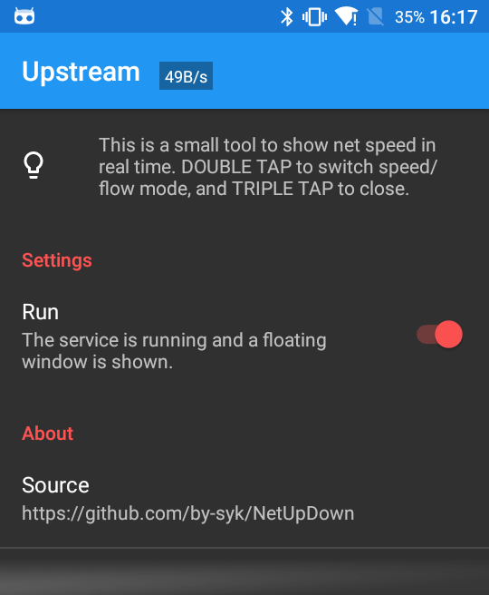

# Upstream - Net speed floating window

### Description

**Upstream** is a small tool to show net speed as floating window in real time.

### Download

* Get it
   * on [Google Play](https://play.google.com/store/apps/details?id=com.by_syk.netupdown "Upstream")
   * on [Cool Market](http://www.coolapk.com/apk/com.by_syk.netupdown "Upstream")

### FAQ

View it [here](FAQ.md).

### Contact author

* E-mail: [By_syk@163.com](mailto:By_syk@163.com "By_syk")

### Donate

If you like it, you could pay me a cup of coffee. Thank you.

* Alipay: By_syk@163.com
* PayPal: By_syk@163.com

### License

    Copyright 2016-2017 By_syk

    Licensed under the Apache License, Version 2.0 (the "License");
    you may not use this file except in compliance with the License.
    You may obtain a copy of the License at

       http://www.apache.org/licenses/LICENSE-2.0

    Unless required by applicable law or agreed to in writing, software
    distributed under the License is distributed on an "AS IS" BASIS,
    WITHOUT WARRANTIES OR CONDITIONS OF ANY KIND, either express or implied.
    See the License for the specific language governing permissions and
    limitations under the License.

*Copyright &#169; 2016-2017 By_syk. All rights reserved.*