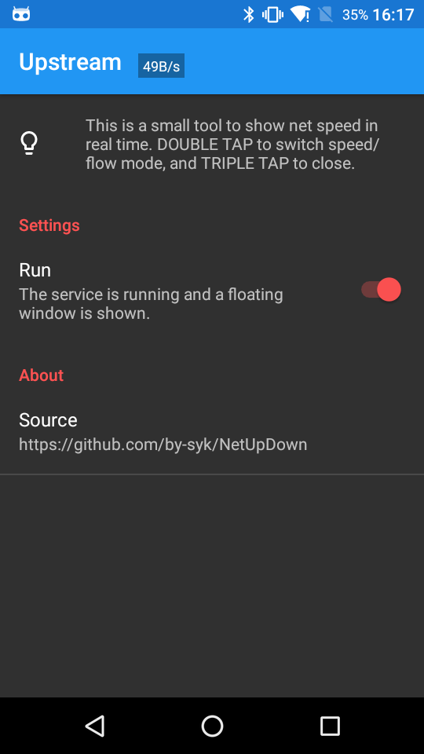

# Upstream - Net speed floating window

### Description

**Upstream** is a small tool to show net speed as floating window in real time.

### Download

* Get it
   * on [Google Play](https://play.google.com/store/apps/details?id=com.by_syk.netupdown "Upstream")
   * on [Cool Market](http://www.coolapk.com/apk/com.by_syk.netupdown "Upstream")

### Contact author

* E-mail: [By_syk@163.com](mailto:By_syk@163.com "By_syk")

### Donate

If you like it, you could pay me a cup of coffee. Thank you.

* Alipay: By_syk@163.com
* PayPal: By_syk@163.com

*Copyright &#169; 2016 By_syk. All rights reserved.*